**пшРОССИЙСКИЙ УНИВЕРСИТЕТ ДРУЖБЫ НАРОДОВ** 

**Факультет физико-математических и естественных наук Кафедра прикладной информатики и теории вероятностей** 

**ОТЧЕТ**  

**ПО ЛАБОРАТОРНОЙ РАБОТЕ №  2** 

*Дисциплина:  Архитектура компьютера* 

Студент:   Габидов Ислам Магомедович                                                                                                                     Группа:  НММбд-01-24              

**МОСКВА** 2024 г. 

**Содержание** 

1. Цель работы  
1. Задание  
1. Выполнение лабораторной работы  
1. Вывод 
1. **Цель работы** 

Цель данной работы - исследовать концепции и использование систем контроля версий, а также приобрести практические навыки работы с git 

2. **Задание** 
1) Порядок выполнения лабораторной работы 
1. Настройка github 
1. Базовая настройка git 
1. Создание SSH ключа 
1. Создание рабочего пространства и репозитория курса на основе 

шаблона 

5. Создание репозитория курса на основе шаблона 
5. Настройка каталога курса 
2) Задание для самостоятельной работы 

`     `В ходе выполнения лабораторной работы предстоит создать отчёт в соответствующем каталоге рабочего пространства (labs>lab02>report), скопировать отчёт по выполнению предыдущих лабораторных работ в соответстующие каталоги и загрузить все файлы на GitHub. 

**3. Выполнение задания** 

`     `Сначала зарегистрируем личную учётную запись на сайте [https://github.com/ ](https://github.com/)и заполним необходимые данные (рис. 1). 

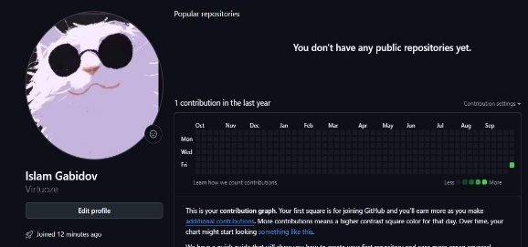

Рис 1. Учётная запись на[ https://github.com/ ](https://github.com/)

Сделаем предварительную конфигурацию git, указав имя и email владельца репозитория. 

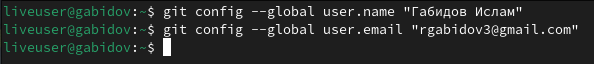

Рис 2. Параметры user.name и user.email 

Настроим utf-8 в выводе сообщений git, зададим имя начальной ветке(будем называть её master), укажем значение параметров autocrlf и safecrlf (Рис 3) 

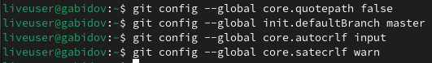ы 

Рис 3 Настройка utf-8 вывода, имени ветки и параметров autocrlf и safecrlf 

Для последующей идентификации пользователя на сервере репозиториев сгенерируем пару ключей(приватный и открытый) (Рис. 4) 

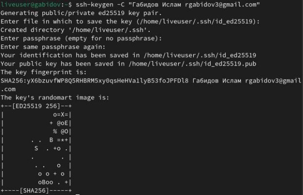

Рис. 4 Создание SSH ключа 

Далее загрузим сгенерированный открытый ключ на Github, предварительно скопировав его в буфер обмена (рис. 5. рис.6). 

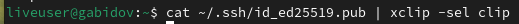

Рис. 5 Копирование ключа в буфер обмена 

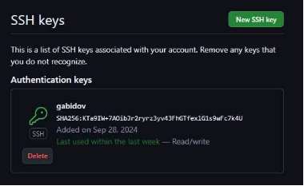

Рис.6 Загрузка ключа на GitHub 

Создадим каталог для предмета «Архитектура компьютера» для создания рабочего пространства (рис.7). 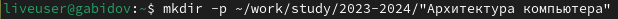

Рис.7 Создание каталога для предмета «Архитектура компьютера» 

Через web-интерфейс github создадим репозиторий на основе шаблона, указав имя study\_2024-2025\_arh-pc (рис.8). 

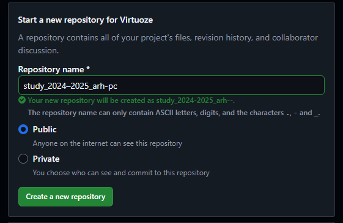

Рис.8 Создание репозитория 

Перейдём в каталог курса и скопируем в него созданный репозиторий с помощью ссылки для клонирования (Рис.9,10). 

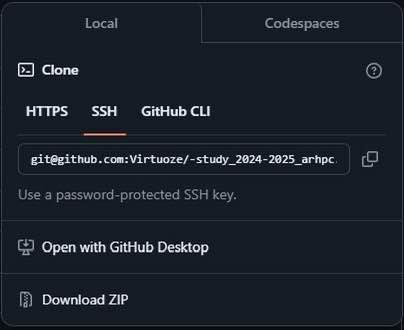

Рис.9 Ссылка для клонирования 

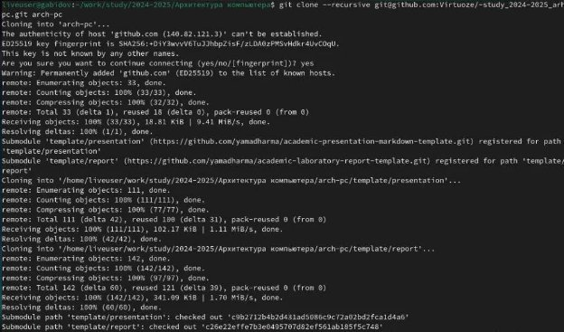

Рис. 10 Клонирование репозитория 

Перейдём в каталог курса, удалим лишние файлы, создание нужные каталоги и загрузим файлы на сервер (рис. 11, 12, 13.1, 13.2). 

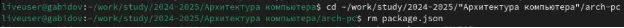

Рис. 11 Удаление лишних файлов 

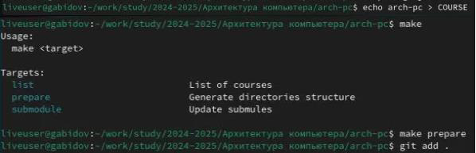

Рис. 12 Создание нужных каталогов 

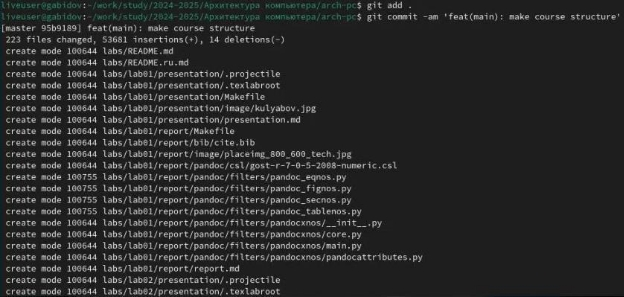

Рис. 13.1 Загрузка файлов на сервер 

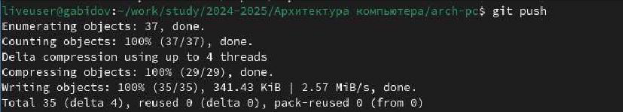

Рис. 13.2 Загрузка файлов на сервер 
Проверим праильность введённых команд (Рис. 14). 

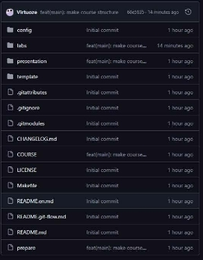

Рис. 14 Проверка 

Начнём выполнение заданий для самостоятельной работы. Скопируем отчёты по выполнению прошлых лабораторных работ в соответсвующие каталоги рабочего пространства. (рис. 15). 

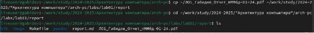

Рис. 15 Копирование прошлого отчёта Загрузим файлы на сервер (рис. 17, 18.1) 

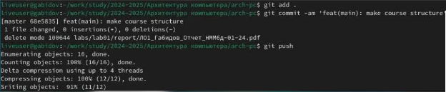

Рис. 17 Загрузка файлов на сервер. 

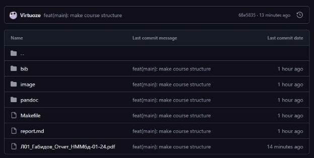

Рис. 18.1 Проверка 

**4 Вывод** 

В ходе выполнения этой лабораторной работы я исследовал концепции и познакомился с использованием систем контроля версий, а также приобрёл практические навыки работы с github. 
