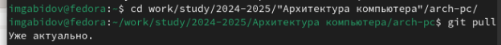
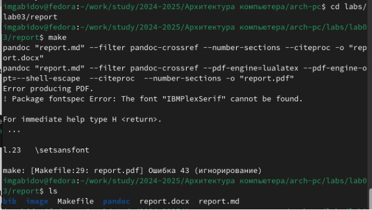
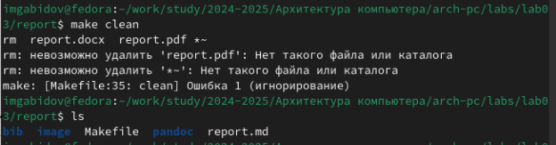
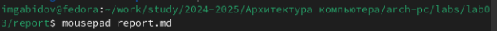
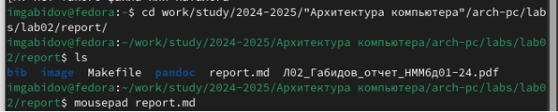

Отчёт по лабораторной работе №3

Дисциплина: Архитектура компьютера

`                                                                       `Студент: Габидов Ислам Магомедович

`                                                                                                       `Группа: НММбд-01-24

`                                                                  `МОСКВА

`                                                                    `2024 г.

# Содержание

# 1. Цель работы
# 2. Задание
# 3. Теоретическое введение
# 4. Выполнение лабораторной работы
# 5\. Вывод
# 6\. Список Литературы

# 1. Цель работы
Целью работы является освоение процедуры оформления отчетов с помощью легковесного языка разметки Markdown.

# 2. Задание
- Установка необходимого программного обеспечения 
- Заполнение отчета по выполнению лабораторной работы №3 с помощью языка разметки Markdown
- Выполнение самостоятельной работы

# 3. Теоретическое введение
Markdown — облегчённый язык разметки, созданный с целью обозначения форматирования в простом тексте, с максимальным сохранением его читаемости человеком, и пригодный для машинного преобразования в языки для продвинутых публикаций (HTML, Rich Text и других).

# 4\. Выполнение лабораторной работы
## 4.1	Компиляция шаблонов отчета
В терминале перехожу в директорию курса, обновляю репозиторий с удаленного на GitHub. (рис. 1)

*Рис. 1: Обновление изменений в директории курса*

Провожу компиляцию шаблона с помощью команды make и проверяю корректность исполнения команды с помощью команды ls (рис. 2)

*Рис. 2: Компиляция шаблона и проверка* 

После проверки работоспособности компилятора шаблонов, я удаляю сгенерированные файлы с помощью команды make clean (рис. 3)

*Рис. 3: Удаление сгенерированных шаблонов*

С помощью редактора выполняю отчет по выполненной лабораторной работе (рис. 4)

*Рис. 4: Подготовка отчёта*
## 4.2	Задания для самостоятельной работы
Выполняю отчет в markdown по второй лабораторной работе,аналогично прошлой, для этого перехожу в директорию 2 лабораторной работы и готовлю отчет с помощью текстового редактора mousepad

` `(рис. 5)

*Рис. 5: Выполнение отчета по 2 лабораторной работе*
#
#

# 5	Выводы
В результате выполнения данной лабораторной работы я освоила процедуры оформления отчетов с помощью легковесного языка разметки Markdown.

# 6	Список литературы 
# 1. Компьютерные науки и технологии программирования. Раздел "Архитектура компьютеров"
